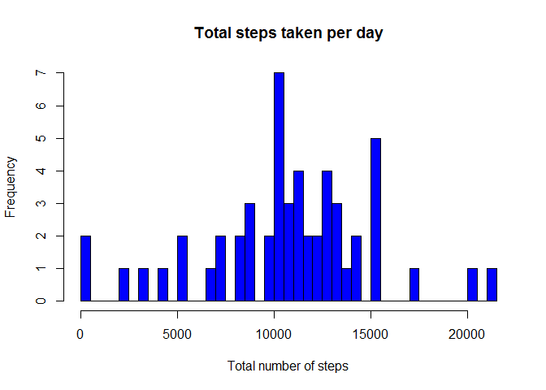
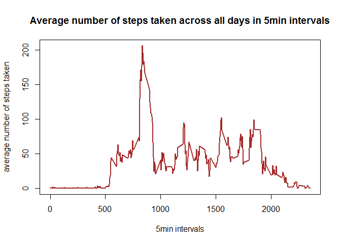
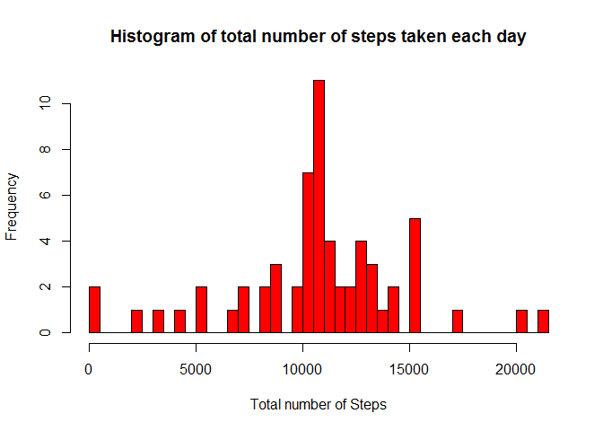
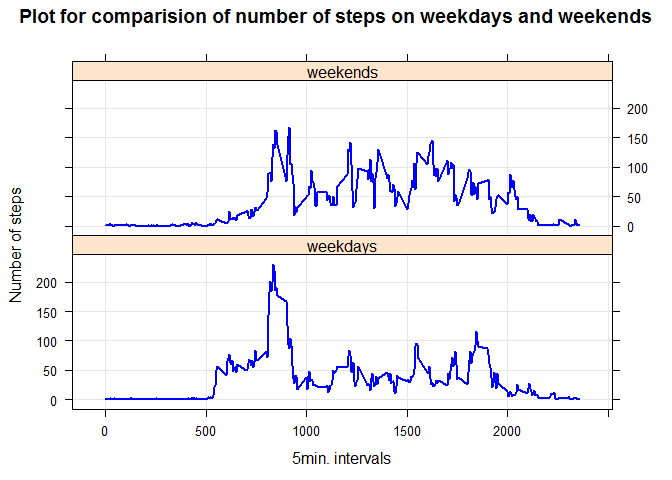

------------------------------------------------------------------------

title: "PA1\_template" output: md\_document: variant: markdown\_github ---

Reproducible Research: Assessment 1
-----------------------------------

For this part of the assignment, calculate the total number of steps taken per day What is the mean total number of steps per day?

``` r
library(lattice)
library(dplyr)
```

    ## 
    ## Attaching package: 'dplyr'

    ## The following objects are masked from 'package:stats':
    ## 
    ##     filter, lag

    ## The following objects are masked from 'package:base':
    ## 
    ##     intersect, setdiff, setequal, union

``` r
library(knitr)
activity <- read.csv('C:/Users/UZagaar/Google Drive/Personal/School/DataScienceTookkitclass/represearch/activity.csv', header = TRUE, sep = ",")
activity$date <- as.Date(activity$date)


activityfile2 <- group_by(activity,date)
activityfile2 <- na.omit(activityfile2)
dailysteps <- summarise(activityfile2,total_steps = sum(steps))

head(dailysteps)
```

    ## Source: local data frame [6 x 2]
    ## 
    ##         date total_steps
    ##       (date)       (int)
    ## 1 2012-10-02         126
    ## 2 2012-10-03       11352
    ## 3 2012-10-04       12116
    ## 4 2012-10-05       13294
    ## 5 2012-10-06       15420
    ## 6 2012-10-07       11015

``` r
summary(dailysteps)
```

    ##       date             total_steps   
    ##  Min.   :2012-10-02   Min.   :   41  
    ##  1st Qu.:2012-10-16   1st Qu.: 8841  
    ##  Median :2012-10-29   Median :10765  
    ##  Mean   :2012-10-30   Mean   :10766  
    ##  3rd Qu.:2012-11-16   3rd Qu.:13294  
    ##  Max.   :2012-11-29   Max.   :21194

Create the histogram for the total number of steps taken each day

``` r
#png("plot1.png",width = 480, height = 480)
hist(dailysteps$total_steps,main = "Total steps taken per day",
     xlab = "Total number of steps",col = "blue",
     breaks= length(dailysteps$total_steps)-1,plot = TRUE)
```

<!-- -->

Calculate and report the mean and median of the total number of steps taken per day

``` r
MeanStepsPerDay <- mean(dailysteps$total_steps)
MedianStepsPerDay <-median(dailysteps$total_steps)

MeanStepsPerDay
```

    ## [1] 10766.19

``` r
MedianStepsPerDay
```

    ## [1] 10765

What is the average daily activity pattern? Make a time series plot (i.e. type = "l") of the 5-minute interval (x-axis) and the avg number of steps taken, avged across all days (y-axis) Which 5-minute interval, on average across all the days in the dataset, contains the maximum number of steps? Make a time series plot (i.e. type = "l") of the 5-minute interval (x-axis) and the average number of steps taken, averaged across all days (y-axis)

``` r
activityfile3 <- group_by(activity, interval)
activityfile3 <- na.omit(activityfile3)
avgsteps_interval <- summarise(activityfile3, avg_steps = mean(steps)) 
```

png("plot2.png",width = 480, height = 480)

``` r
plot(avgsteps_interval,type = 'l', col = 'brown',lwd=2,
     main = "Average number of steps taken across all days in 5min intervals",
     xlab = "5min intervals",ylab = "average number of steps taken")
```

<!-- -->

Which 5-minute interval, on average across all the days in the dataset, contains the maximum number of steps?

``` r
maxsteps <- filter(avgsteps_interval, avg_steps == max(avg_steps))
cat(sprintf("At %sth 5min interval, the maximum number of %f steps are found on average on all days in the data set. \n", maxsteps$interval, maxsteps$avg_steps))
```

    ## At 835th 5min interval, the maximum number of 206.169811 steps are found on average on all days in the data set.

Calculate and report the total number of missing values in the dataset (i.e. the total number of rows with NAs)

``` r
missing_steps <- sum(is.na(activity$steps))
missing_date <- sum(is.na(activity$date))
missing_interval <- sum(is.na(activity$interval))

cat(sprintf("Total number of missing values in steps field =  %s\n", missing_steps))
```

    ## Total number of missing values in steps field =  2304

``` r
cat(sprintf("Total number of missing values in date field =  %s\n", missing_date))
```

    ## Total number of missing values in date field =  0

``` r
cat(sprintf("Total number of missing values in interval field =  %s\n",missing_interval))
```

    ## Total number of missing values in interval field =  0

Develop a strategy for filling in all of the missing values in the dataset.
For example, you could use the mean/median for that day, or the mean for that 5-minute interval, etc. Create a new dataset that is equal to the original dataset but with the missing data filled in.

create new dataset with removed NA

``` r
activityfile4<- activity
avgsteps <- summarise(activityfile3, mean_steps = mean(steps), median_steps = median(steps))

activityfile4$steps[is.na(activityfile4$steps)] <- tapply(activityfile4$steps, activityfile4$interval, mean, na.rm = TRUE)

#check for any missing values 
sum(is.na(activityfile4))
```

    ## [1] 0

Make a histogram of the total number of steps taken each day and Calculate and report the mean and median total number of steps taken per day. Do these values differ from the estimates from the first part of the assignment? What is the impact of imputing missing data on the estimates of the total daily number of steps?

``` r
activityfile5 <- group_by(activityfile4, date)
dailysteps_afms <- summarise(activityfile5,total_steps = sum(steps))


new_mean <-mean(dailysteps_afms$total_steps)
new_median <-median(dailysteps_afms$total_steps)

cat(sprintf("The new mean is=  %s\n", new_mean))
```

    ## The new mean is=  10766.1886792453

``` r
## The new mean is=  10766.1886792453
cat(sprintf("The new median is =  %s\n", new_median))
```

    ## The new median is =  10766.1886792453

png("plot3.png",width = 480, height = 480)

``` r
hist(dailysteps_afms$total_steps,breaks=length(dailysteps_afms$total_steps)-1, 
     col = 'red', main = "Histogram of total number of steps taken each day",
     xlab = "Total number of Steps",plot = T)
```

<!-- -->

Are there differences in activity patterns between weekdays and weekends?

``` r
activityfile6<- activityfile5
activityfile6$wdays <- weekdays(as.Date(activityfile6$date))

activityfile6 <-mutate(activityfile6, wk.factor = factor((wdays == "Sunday" | wdays == "Saturday"),levels = c(FALSE,TRUE),
                                                 labels = c("weekdays","weekends")))

MeanStep_byIntervalByWkday <- aggregate(steps ~ interval + wk.factor, data=activityfile6, FUN="mean")
```

png("plot4.png",width = 480, height = 480)

``` r
xyplot(steps ~ interval | wk.factor, data=MeanStep_byIntervalByWkday, type="l", grid=T, layout=c(1,2),
       main="Plot for comparision of number of steps on weekdays and weekends",
       xlab = "5min. intervals", ylab = "Number of steps",lwd = 2,col = "blue")
```

<!-- -->

Note that the `echo = FALSE` parameter was added to the code chunk to prevent printing of the R code that generated the plot.
